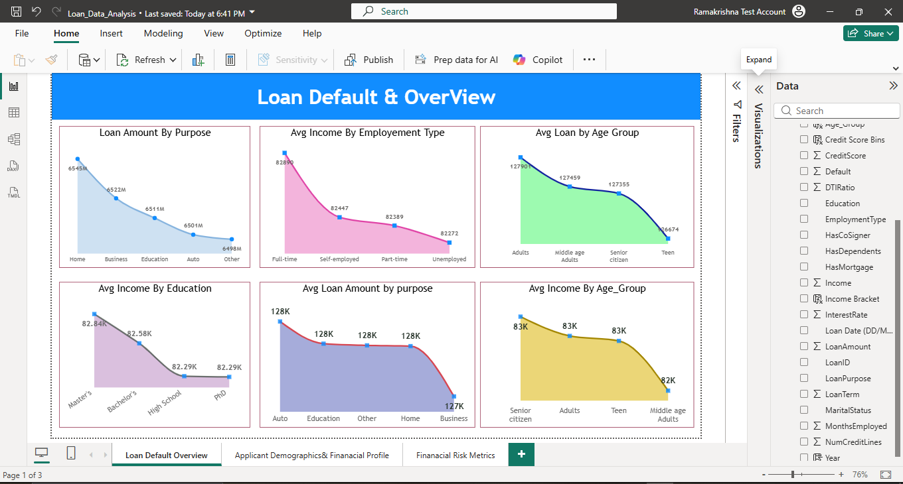
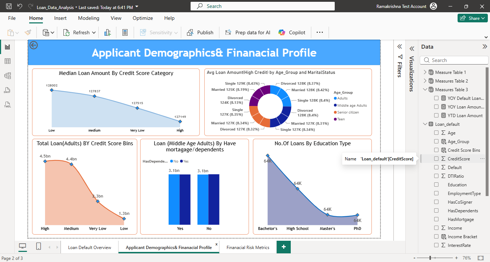
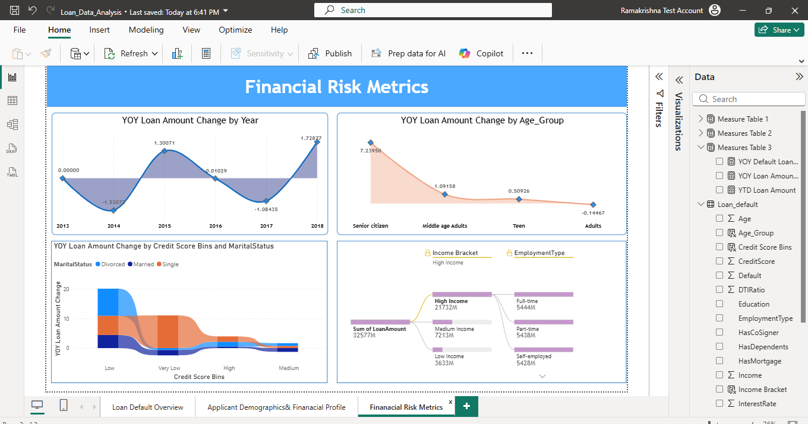

# 📊 Loan Default & Financial Risk Analytics

> **End-to-end Data Analytics project using SQL Server, Power BI Dataflows, Power Query, DAX and Power BI Service to analyze loan portfolio performance, borrower demographics and financial risk.**

## 🎯 Business Problem

A financial organization needs to understand its loan portfolio, borrower characteristics and potential financial risk.

The objective of this project was to build an interactive analytics solution to analyze:

- Loan portfolio performance
- Default behavior
- Borrower demographics
- Credit-score segments
- Employment and education
- Loan purpose
- Mortgage and dependent status
- Year-over-Year performance
- Year-to-Date loan exposure

The project follows an end-to-end BI workflow, from data ingestion and preparation to analysis, visualization, validation and deployment.

---

## 🏗️ End-to-End Architecture

```text
SQL Server
    ↓
Power BI Dataflow
    ↓
Power Query
    ↓
Data Profiling & Transformation
    ↓
Power BI Data Model
    ↓
DAX Measures & Analysis
    ↓
Interactive Power BI Report
    ↓
Power BI Service
    ↓
Scheduled Refresh + Incremental Refresh
```

---

## 🛠️ Technology Stack

| Area | Tools / Skills |
|---|---|
| Data Source | SQL Server |
| Data Preparation | Power BI Dataflow, Power Query |
| Data Analysis | DAX |
| Visualization | Power BI |
| Data Modeling | Power BI Data Model |
| Deployment | Power BI Service |
| Refresh | On-premises Data Gateway, Scheduled Refresh, Incremental Refresh |
| Analytics | Financial Analytics, Risk Analysis, Segmentation, Time Analysis |

---

# 📥 Data Pipeline

### 1. SQL Server

The loan dataset was imported into **Microsoft SQL Server** as the source layer.

### 2. Power BI Dataflow

A **Power BI Dataflow** was created as a reusable cloud-based data preparation layer between the source data and Power BI Desktop.

### 3. Power Query

The dataset was inspected and prepared using Power Query, including:

- Data type validation
- Data profiling
- Column inspection
- Data preparation
- Dataset understanding

### 4. Power BI Desktop

The prepared data was imported from the Dataflow into Power BI Desktop.

The report was developed using:

- Data modeling
- DAX measures
- Interactive visualizations
- Filters and analytical segmentation
- Time-based analysis

### 5. Power BI Service

The completed report was published to Power BI Service and configured with:

- On-premises Data Gateway
- Scheduled refresh
- Incremental refresh
- Report sharing

---

# 📊 Dashboard Analysis

## 1. Loan Default Overview

Provides a high-level view of the loan portfolio.

### Analysis Included

- Loan Amount by Purpose
- Average Income by Employment Type
- Average Loan Amount by Age Group
- Average Income by Education
- Average Loan Amount by Purpose
- Average Income by Age Group

### Business Purpose

Understand overall loan exposure and borrower financial characteristics across key business dimensions.



---

## 2. Applicant Demographics & Financial Profile

Analyzes how borrower characteristics relate to loan exposure.

### Analysis Included

- Median Loan Amount by Credit Score Category
- Average Loan Amount by Age Group & Marital Status
- Total Adult Loan Amount by Credit Score
- Middle-Age Adult Loans by Mortgage / Dependents
- Number of Loans by Education Type

### Business Purpose

Understand differences in loan exposure across borrower demographics and financial characteristics.



---

## 3. Financial Risk Metrics

Provides deeper financial and time-based analysis.

### Analysis Included

- YoY Loan Amount Change by Year
- YoY Loan Amount Change by Age Group
- YoY Loan Amount Change by Credit Score & Marital Status
- YTD Loan Amount
- Decomposition Tree Analysis

### Business Purpose

Analyze changes in loan performance over time and investigate the dimensions contributing to loan exposure.



---

# 📐 DAX & Analytical Measures

DAX was used to translate business requirements into analytical measures and KPIs.

### Key Measures

- Loan Amount by Purpose
- Average Income by Employment Type
- Default Rate by Employment Type
- Average Loan Amount by Age Group
- Default Rate by Year
- Median Loan Amount by Credit Score Category
- Total Loan Amount by Credit Score Category
- Loan Amount by Mortgage / Dependents
- Loans by Education Type
- YoY Loan Amount Change
- YoY Default Loan Change
- YTD Loan Amount

### DAX Functions Applied

```text
CALCULATE
SUM
SUMX
AVERAGE
AVERAGEX
MEDIANX
FILTER
ALL
ALLEXCEPT
COUNTROWS
DIVIDE
VALUES
SWITCH
ISBLANK
NOT
```

### Analytical Concepts

- Filter Context
- Aggregation
- Segmentation
- Time Intelligence
- YoY Analysis
- YTD Analysis
- Comparative Analysis
- Data Validation

---

# 🔍 Data Validation

Analytical calculations were validated against the underlying data to ensure the results displayed in the report were accurate.

### Validation Performed For

- Average Loan Amount by Age Group
- Default Rate by Year
- Median Loan Amount by Credit Score
- Average Loan Amount by Age Group & Marital Status
- Loan Amount by Mortgage / Dependents
- Education-based loan analysis
- Other DAX-based analytical measures

The validation process helped ensure that the dashboard was not only visually correct but also analytically reliable.

---

# 💡 Business Value

The dashboard enables stakeholders to:

- Monitor overall loan portfolio performance
- Identify borrower segments with different levels of loan exposure
- Track default-related trends
- Compare loan performance across time
- Analyze loan exposure across credit and demographic dimensions
- Investigate contributing factors using Decomposition Tree analysis
- Monitor reporting metrics through Power BI Service
- Access refreshed reporting through a repeatable refresh workflow

---

# 🔄 Complete End-to-End Workflow

```text
                    RAW DATA
                        │
                        ▼
                  SQL SERVER
                        │
                        ▼
              POWER BI DATAFLOW
                        │
                        ▼
                 POWER QUERY
                        │
              ┌─────────┴─────────┐
              │                   │
       Data Profiling       Data Preparation
              │                   │
              └─────────┬─────────┘
                        ▼
                 POWER BI MODEL
                        │
                        ▼
                  DAX ANALYSIS
                        │
           ┌────────────┼────────────┐
           ▼            ▼            ▼
       Portfolio     Applicant      Risk
       Analysis      Analysis     Analysis
           │            │            │
           └────────────┼────────────┘
                        ▼
                 POWER BI REPORT
                        │
                        ▼
                 POWER BI SERVICE
                        │
              ┌─────────┴─────────┐
              ▼                   ▼
       Scheduled Refresh    Incremental Refresh
```
